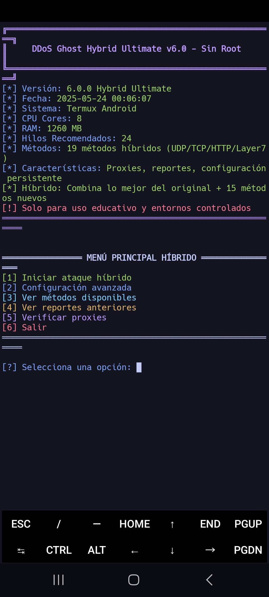
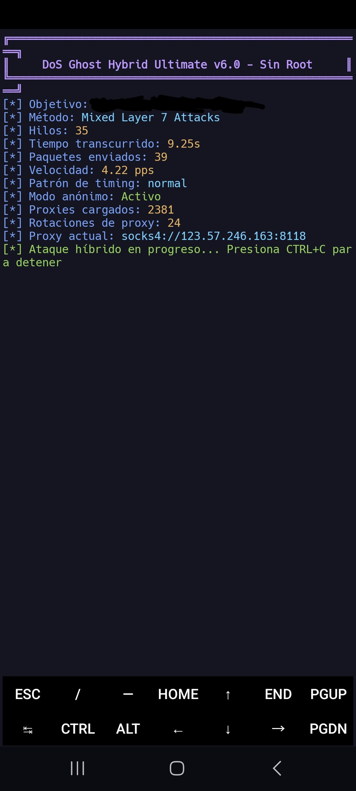
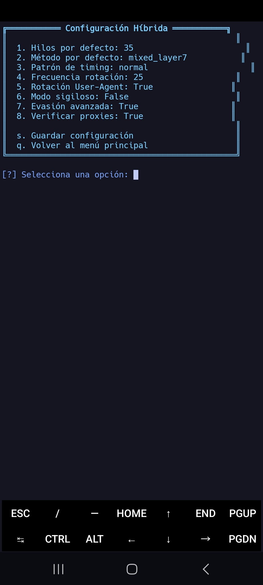
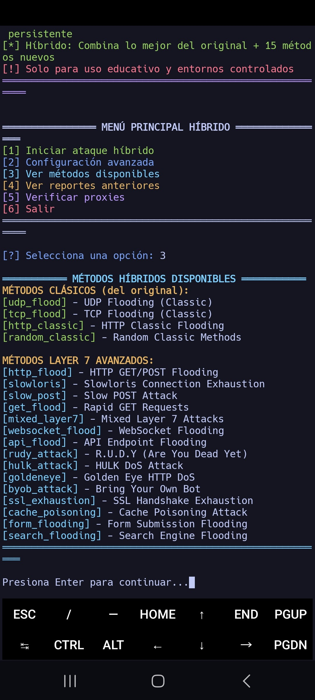

# DoS Ghost Hybrid Ultimate - Herramienta de Pruebas de Estrés Avanzada


## ⚠️ Descargo de Responsabilidad

**Esta herramienta está diseñada exclusivamente para fines educativos, de investigación y pruebas de seguridad en entornos controlados y autorizados.**

- El uso de esta herramienta contra sistemas sin permiso explícito es **ILEGAL** y puede resultar en consecuencias legales severas.
- El desarrollador NO se hace responsable del mal uso de esta herramienta.
- Al usar este software, aceptas utilizarlo solo en sistemas que posees o para los cuales tienes autorización explícita para realizar pruebas.

## 🆕 Novedades de la Versión 6.0.0 Hybrid Ultimate

📱 Menú Principal


- 🚀 **19 métodos de ataque híbridos** (UDP/TCP clásicos + 15 Layer 7 avanzados)
- ⚡ **Ataques asíncronos** optimizados para máximo rendimiento
- 🥷 **15 métodos Layer 7**: Slowloris, RUDY, HULK, Golden Eye, SSL Exhaustion
- 🔄 **Sistema híbrido** que combina lo mejor de ambos mundos
- 🎯 **Detección automática de CMS** (WordPress, Apache, Nginx)
- 📱 **Optimización inteligente** según recursos del dispositivo
- 🌐 **Soporte completo para proxies** en todos los métodos
- 📊 **Monitor de recursos en tiempo real** (CPU, RAM, ancho de banda)
- ⚙️ **Configuración persistente** mejorada con más opciones
- 🔧 **Instalación automática** de dependencias


🎯 Ataque en Progreso


⚙️ Configuración Avanzada  


## 📋 Métodos de Ataque Disponibles

📊 Lista Completa de Métodos


### 🔥 Métodos Clásicos (Compatibilidad con v4.0)
- ✅ **UDP Flood** - Saturación UDP tradicional
- ✅ **TCP Flood** - Inundación TCP clásica
- ✅ **HTTP Classic** - Flooding HTTP básico
- ✅ **Random Classic** - Métodos aleatorios tradicionales

### ⚡ Métodos Layer 7 Avanzados (Nuevos en v6.0)
- 🎯 **HTTP Flood** - GET/POST masivos con headers reales
- 🐌 **Slowloris** - Agotamiento de conexiones TCP
- 📨 **Slow POST (RUDY)** - "Are You Dead Yet" attack
- 🚀 **GET Flood** - Requests rápidos con cache busting
- 🔀 **Mixed Layer 7** - Combinación inteligente de métodos
- 🌐 **WebSocket Flood** - Saturación de conexiones WebSocket
- 🔌 **API Flood** - Ataques especializados en APIs REST
- 💀 **HULK Attack** - Requests complejos con parámetros variables
- 👁️ **Golden Eye** - Múltiples métodos HTTP simultáneos
- 🤖 **BYOB Attack** - "Bring Your Own Bot" combinado
- 🔒 **SSL Exhaustion** - Agotamiento de handshakes SSL/TLS
- 🗃️ **Cache Poisoning** - Envenenamiento de cache web
- 📝 **Form Flooding** - Spam masivo de formularios
- 🔍 **Search Flooding** - Saturación de motores de búsqueda internos

## 🛠️ Instalación

### Requisitos
- **Android 7+** con Termux instalado
- **Python 3.7+** (se instala automáticamente)
- **4+ GB RAM** recomendado para máximo rendimiento
- **Conexión a Internet** estable

### Instalación Rápida
```bash
# Actualizar Termux
pkg update && pkg upgrade -y

# Instalar dependencias básicas
pkg install python git -y

# Clonar el repositorio
git clone https://github.com/Darkrevengehack/DDoS-ghost.git

# Entrar al directorio
cd DDoS-ghost

# Instalar dependencias Python automáticamente
pip3 install -r requirements.txt

# Ejecutar
python3 ddos_script.py
```

## 🎮 Uso

### Menú Interactivo Híbrido
Al ejecutar el script, verás un menú con 6 opciones:

```
════════════════ MENÚ PRINCIPAL HÍBRIDO ════════════════
[1] Iniciar ataque híbrido
[2] Configuración avanzada  
[3] Ver métodos disponibles
[4] Ver reportes anteriores
[5] Verificar proxies
[6] Salir
═════════════════════════════════════════════════════════
```

### Uso con Argumentos
```bash
# Ataque básico HTTP Layer 7
python3 ddos_script.py -t http://example.com -m http_flood

# Ataque devastador con proxies
python3 ddos_script.py -t https://example.com -m byob_attack -th 50 -a

# Slowloris sigiloso
python3 ddos_script.py -t http://example.com -m slowloris -th 25 -tp stealth

# SSL Exhaustion con archivo de proxies
python3 ddos_script.py -t https://example.com -m ssl_exhaustion -pf proxies.txt

# Ataque mixto Layer 7 optimizado
python3 ddos_script.py -t http://example.com -m mixed_layer7 -th 45 -a -v
```

### Parámetros Disponibles
```
-t, --target          URL o IP objetivo (requerido)
-p, --port            Puerto objetivo (solo para IPs)
-th, --threads        Número de hilos (auto-detectado según dispositivo)
-m, --method          Método de 19 disponibles (default: mixed_layer7)
-a, --anonymous       Modo anónimo con proxies automáticos
-pf, --proxy-file     Archivo con lista de proxies
-v, --verify-proxies  Verificar proxies antes de usar
-tp, --timing-pattern Patrón: aggressive, normal, stealth, human_like
-s, --stealth         Activar modo sigiloso avanzado
-rf, --rotation-freq  Frecuencia rotación proxies (default: 25)
```

## 🎯 Métodos Recomendados por Objetivo

### 🌐 Servidores Web (HTTP/HTTPS)
- **Devastador**: `byob_attack`, `mixed_layer7`
- **Sigiloso**: `slowloris`, `rudy_attack`  
- **Rápido**: `http_flood`, `get_flood`

### 🔒 Servidores HTTPS/SSL
- **Especializado**: `ssl_exhaustion`
- **Combinado**: `mixed_layer7` con SSL

### 🗄️ APIs REST
- **Específico**: `api_flood`
- **Formularios**: `form_flooding`

### 🔍 Sitios con Búsqueda
- **Targeted**: `search_flooding`
- **Cache**: `cache_poisoning`

## 🔧 Configuración de Proxies

### Formato de Archivo de Proxies
```
# Formato recomendado
socks5:192.168.1.1:1080
socks4:10.0.0.1:4145
http:203.0.113.1:8080

# Formatos alternativos
192.168.1.1:1080:socks5
10.0.0.1:4145:socks4
203.0.113.1:8080:http
```

### Verificación Automática de Proxies
El sistema incluye verificación automática que:
- ✅ Prueba conectividad de cada proxy
- ⚡ Mide velocidad de respuesta
- 📊 Asigna puntuación por rendimiento
- 🔄 Ordena por mejor calidad

## 📊 Características Avanzadas

### 🧠 Detección Automática de Recursos
- **CPU**: Auto-detecta cores disponibles
- **RAM**: Ajusta hilos según memoria disponible
- **Termux**: Optimizaciones específicas para Android
- **Threads**: Recomendaciones inteligentes por dispositivo

### ⏱️ Patrones de Timing Inteligentes
- **Aggressive**: 0.001-0.005s (máxima velocidad)
- **Normal**: 0.01-0.05s (equilibrado)
- **Stealth**: 0.1-0.5s (sigiloso)
- **Human_like**: 1.0-3.0s (simula comportamiento humano)

### 📈 Monitoreo en Tiempo Real
- 📊 **CPU y RAM**: Uso de recursos del sistema
- 🌐 **Ancho de banda**: Upload/download en KB/s
- 📦 **Paquetes**: Contador y velocidad (PPS)
- 🔄 **Proxies**: Rotaciones y estado actual

### 💾 Sistema de Reportes Híbrido
Los reportes incluyen métricas avanzadas:
```json
{
  "timestamp": "2025-01-22T15:30:45",
  "duration": 120.5,
  "packets_sent": 25680,
  "packets_per_second": 213.17,
  "proxy_rotations": 68,
  "proxies_used": 34,
  "version": "Ghost Hybrid v6.0"
}
```

## 🔥 Rendimiento

### 📱 Optimizaciones para Dispositivos Móviles
- **Detección automática**: Termux vs otros entornos
- **Limits inteligentes**: Previene sobrecarga del sistema
- **Async/await**: Máximo rendimiento con mínimo consumo
- **Threading optimizado**: Escala según hardware disponible

### 📈 Benchmarks por Dispositivo
- **2GB RAM**: 15-25 threads recomendados (1,000-2,000 PPS)
- **4GB RAM**: 25-35 threads recomendados (2,000-3,500 PPS)  
- **6GB+ RAM**: 35-50 threads recomendados (3,500-5,000+ PPS)
- **CPU 8+ cores**: Rendimiento óptimo en métodos híbridos

### ⚡ Métodos Más Efectivos por Potencia
- **Máxima velocidad**: `get_flood`, `http_flood`
- **Máximo impacto**: `byob_attack`, `mixed_layer7`
- **Mínimo consumo**: `slowloris`, `ssl_exhaustion`

## 🛡️ Evasión y Anti-Detección

### 🥷 Técnicas Implementadas
- **Rotación automática** de 15+ User-Agents reales
- **Headers HTTP diversos** con valores aleatorios
- **Proxies rotativos** con verificación automática
- **Timing humano** con patrones variables
- **Payloads específicos** según CMS detectado

### 🎭 Modo Sigiloso Avanzado
- Simula navegación web legítima
- Headers realistas de navegadores populares
- Patrones de timing que emulan usuarios reales
- Requests a endpoints comunes (/robots.txt, /favicon.ico)

## 🤝 Contribución

Las contribuciones son bienvenidas. Por favor:
- Haz fork del repositorio
- Crea una rama feature (`git checkout -b feature/mejora`)
- Commit tus cambios (`git commit -am 'Añadir nueva característica'`)
- Push a la rama (`git push origin feature/mejora`)
- Abre un Pull Request

### 🎯 Áreas de Mejora Prioritarias
- Nuevos métodos Layer 7
- Optimizaciones de rendimiento
- Técnicas anti-detección
- Soporte para más protocolos
- Mejoras en la interfaz

## 📜 Licencia

Este proyecto está licenciado bajo la **GNU General Public License v3.0** - consulta el archivo [LICENSE](LICENSE) para más detalles.

## 📞 Soporte y Contacto

- **Issues**: [GitHub Issues](https://github.com/Darkrevengehack/DDoS-ghost/issues)
- **Telegram**: [@Darkrevengehack](https://t.me/Darkrevengehack)
- **Repositorio**: [GitHub](https://github.com/Darkrevengehack/DDoS-ghost.git)

#### Happy Ethical Hacking 🕵️

---

**⚠️ Recordatorio Legal**: Este software se proporciona bajo licencia GPL-3.0, sin garantía de ningún tipo. El autor no se hace responsable por el mal uso o daños causados por esta herramienta. Usar únicamente en sistemas propios o con autorización explícita.
